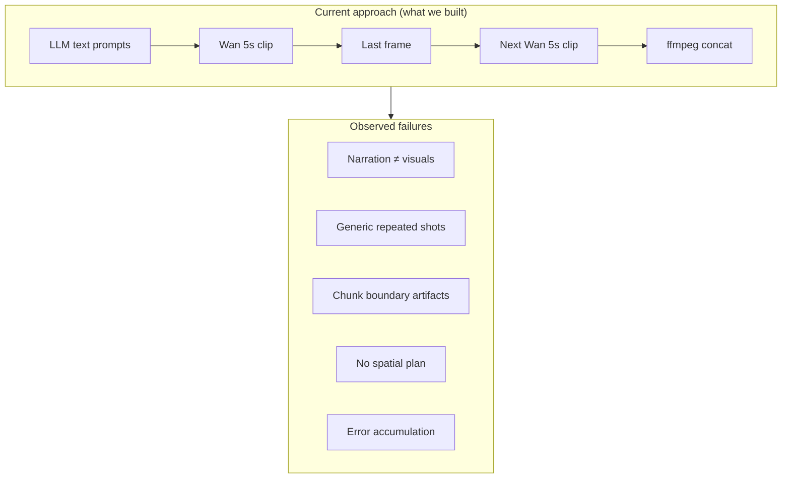
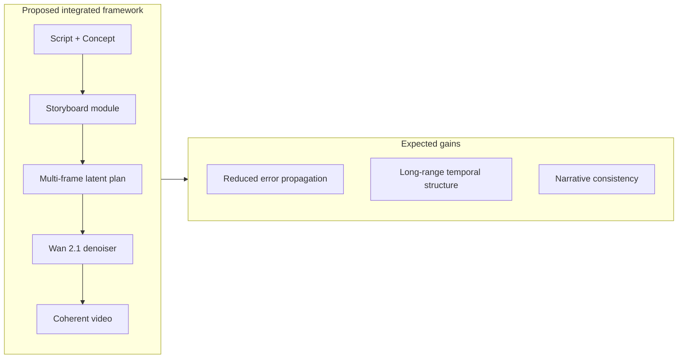

# Limitations of the Current Approach & Proposed Storyboard-Guided Direction

**Project:** AI-generated NCERT Physics Shorts (Kinematics)  
**Example run:** `physics_03_Introduction_to_Motion`  
**Author note:** This document describes work already attempted, why the output quality was unsatisfactory, and the research direction being pursued next.

For the full pipeline description of what was built, see [PIPELINE_DOCUMENTATION.md](./PIPELINE_DOCUMENTATION.md).

---

## 1. What Was Attempted

We built an end-to-end pipeline that converts an NCERT concept card into a ~75-second vertical educational Short:

```
Concept Card (JSON)
    → LLM story planning (hook, 4-beat arc, narration)
    → Visual director (text chunk prompts, ~5s each)
    → Wan 2.1 video generation (T2V + I2V chaining)
    → Hybrid teaching overlay (equation strip)
    → ffmpeg compose (crossfade, voiceover, subtitles)
    → final_short.mp4
```

**Command used for the latest re-render:**

```bash
export SUBJECT=physics VIDEO_BACKEND=local_video VISUAL_SETTING=city_car \
  WAN_HEIGHT=1280 WAN_WIDTH=704 WAN_STEPS=60

CUDA_VISIBLE_DEVICES=0 bash scripts/rerender_scenes.sh \
  outputs/kinematics_run/physics_03_Introduction_to_Motion
```

**Technical choices:**

| Choice | Rationale |
|--------|-----------|
| Wan 2.1 T2V (1.3B) for first chunk | Bootstrap video from text when no prior frame exists |
| Wan 2.1 I2V (14B) for all later chunks | Continue from last frame to preserve appearance |
| ~5s chunks (max 81 frames @ 16 fps) | Wan degrades beyond ~5s per pass |
| Last-frame seeding across chunks and scenes | Cheap continuity heuristic |
| Text-only `chunk_prompts` | No spatial layout, no keyframe structure |
| Local LLM (Qwen 7B) for planning | No cloud dependency for narrative |

**Observed cost:** ~35 minutes per Wan I2V pass × 16 chunks ≈ **9 hours GPU time** for one 75-second video at `WAN_STEPS=60`.

---

## 2. Observed Output Quality (Honest Assessment)

The pipeline **does produce a complete video**, but the result is **not good enough** for publication or classroom use. The problems are structural, not merely hyperparameter tuning.

### 2.1 Narration–Visual Mismatch (Semantic Incoherence)

The spoken script and the generated visuals describe **different stories**:

| Beat | Narration says | Video shows |
|------|----------------|-------------|
| Scene 1 | Cricket player sprinting to catch a ball | White car at a traffic light |
| Scene 2 | A person walking from home to school | Same car accelerating on a road |
| Scene 3 | "Now you can see why the **maths** works" | Car driving (physics topic, but visuals don't illustrate walking/distance) |

**Root cause:** Planning is split across independent LLM modules (`hook_spec.json` describes cricket; `visual_director` forces `city_car`; `narration.json` mixes both). There is **no single grounded visual plan** aligned to the script. Each module optimizes locally; nothing enforces cross-modal consistency.

Evidence from artifacts:

- `hook_spec.json`: *"3D cartoon Arjun shrinks and enters a cricket field"*
- `story_arc.json`: `visual_setting: "city_car"`, chunk prompts about a white car
- `narration.json` scene 1: cricket hook; scene 2: person walking

A viewer hears one story and sees another. This fails the basic requirement of educational video: **visuals must support what is being explained**.

---

### 2.2 Repetitive and Generic Visual Content (Scenes 3–4)

In `story_arc.json`, scenes 3 and 4 use **near-identical chunk prompts**:

```
"Same white car, same road. Gentle tracking shot, same world."
(repeated 4–5 times)
```

This happens because the visual director falls back to **generic templates** when the LLM narration is flagged as non-specific (`is_generic_narration()` in `agents/visual_director.py`). The fallback bank only has two templates per setting; when a scene needs 5 chunks, the last template is reused.

**Observed effect:**

- Scenes 3 and 4 look visually **static and monotonous** — the car drives with no meaningful narrative progression.
- The "reveal" beat (scene 3) does not visually demonstrate speed, distance, or time — it only repeats a tracking shot.
- The equation overlay (`speed = distance/time`) appears on screen, but the animation underneath does not **show** those quantities changing.

**Root cause:** Text prompts alone cannot encode *what should happen at second 12 vs second 18*. Without a structured storyboard (keyframes, poses, camera moves per timestep), the model fills duration with generic motion.

---

### 2.3 Poor Temporal Continuity Across Chunks

Each ~5s segment is generated **independently**, conditioned only on:

1. A text prompt (~15 words)
2. The **last frame** of the previous chunk (I2V seed)

There is **no plan for intermediate motion**. Consequences:

| Issue | Why it happens |
|-------|----------------|
| **Visual drift** | Car color, road width, lighting, and background shift chunk-to-chunk; last-frame seeding preserves one pixel, not scene semantics |
| **Motion discontinuities** | Speed may jump or reverse at chunk boundaries; no velocity or trajectory constraint |
| **Camera jumps** | Prompt says "low angle" then "wide shot" with no smooth transition plan |
| **Character/object morphing** | Wan I2V hallucinates detail in regions not anchored by the seed frame |

Chunk durations in scene 1: 5s + 5s + 5s + 3s = 18s — four separate diffusion runs stitched by ffmpeg concat. Crossfade is applied only **between scenes** (1.2s), not **between chunks within a scene**.

**Root cause:** Chaining short I2V clips via last-frame conditioning is a **greedy autoregressive hack**. Error accumulates over 16 passes. There is no global temporal model of the full 75s sequence.

---

### 2.4 Model and Resolution Mismatch

The pipeline switches models mid-video:

| Pass | Model | Parameters |
|------|-------|------------|
| Scene 1, chunk 0 | Wan T2V 1.3B | Text → video |
| All other chunks | Wan I2V 14B 480P | Image → video |

The I2V model resizes the seed frame to its internal resolution (`704×1264` in our run, derived from aspect ratio snapping). T2V and I2V were **not co-trained for this chaining setup**; appearance and motion priors differ. The first chunk establishes a look that subsequent I2V passes **approximate** rather than **continue**.

---

### 2.5 Audio–Video Desynchronization Risk

Subtitles and scene timing are driven by **planned** `duration_seconds` in `story_arc.json`, not by actual generated motion or TTS word timing:

- Scene 1: 18s planned → 18s clip (matches)
- Total planned: 75s; existing `compose/raw_concat.mp4` from a prior run: **72s**

Voiceover was generated in an earlier full run and is **reused unchanged** during re-render. If visual pacing changes (e.g., slower acceleration in new chunks), narration may no longer align with what is on screen.

**Root cause:** No joint optimization of script timing and visual events.

---

### 2.6 Teaching Overlay Decoupled from Animation

The hybrid teaching strip (`render/hybrid_beat.py`) composites a LaTeX equation PNG at the bottom of `anim_raw.mp4`. The equation is correct, but:

- It is **not synchronized** to a visual event (e.g., distance markers appearing, clock ticking).
- It is applied **after** video generation — the Wan model never "knows" the formula is being taught.
- Scene 2 narration mentions walking; overlay shows `speed = d/t` while video shows a car — the metaphor is weak.

**Root cause:** Pedagogy is a post-processing layer, not part of the generative plan.

---

### 2.7 High Compute Cost vs. Low Controllability

| Metric | Value |
|--------|-------|
| GPU time | ~9 hours (single GPU, WAN_STEPS=60) |
| Output length | 75 seconds |
| Controllability | Text prompts only; no layout, depth, or multi-frame plan |
| Iteration cost | Re-rendering one bad scene still requires re-running many chunks |

We spent significant compute to produce a video that is **temporally fragmented, semantically misaligned, and visually repetitive**. Prompt engineering and last-frame chaining do not scale to long-form coherent narrative.

---

### 2.8 Summary: Why Text-Only Chunk Prompts Fail



The fundamental gap: **we plan in language but generate in pixels**. Language is ambiguous; last-frame I2V is myopic. There is no intermediate representation that captures *what the video should look like at each story beat* before diffusion runs.

---

## 3. Proposed Direction: Storyboard-Guided Video Generation

Based on the failures above, the next approach treats **storyboard extraction and conditioning** as a first-class stage — not an afterthought.

### 3.1 Core Idea

```
Ground-truth (GT) video
    → Storyboard extraction
        (key events, scene transitions, poses, camera composition, timeline)
    → AI storyboard generation module
        (learns to produce similar structured plans from concept/script)
    → Video generation model (Wan 2.1 or successor)
        conditioned on storyboard
    → Coherent long-form output
```

Instead of:

```
Text prompt → 5s clip → last frame → text prompt → 5s clip → ...
```

We aim for:

```
Structured storyboard (multi-frame plan) → video synthesis with temporal guidance
```

### 3.2 What a Storyboard Representation Should Capture

A storyboard is an **intermediate planning representation** richer than text and cheaper than full video:

| Element | Purpose | Fixes current failure |
|---------|---------|----------------------|
| **Keyframe images or sketches** | Layout, subject identity, background | Reduces visual drift vs. text-only |
| **Per-frame or per-beat camera** | Shot type, angle, motion path | Eliminates camera jumps at chunk boundaries |
| **Event timeline** | What happens at t=0, 5, 10, … seconds | Aligns visuals with narration beats |
| **Character/object pose graph** | Consistent subject across beats | Stronger than single last-frame seed |
| **Scene transition markers** | Cuts, dissolves, continuity type | Controlled joins instead of blind concat |
| **Teaching annotations** | Where equation/measurement appears | Pedagogy inside the plan, not overlaid after |

**Stage 1 (supervised):** Extract storyboards from GT educational videos (or professionally storyboarded reference content) using vision models + temporal segmentation.

**Stage 2 (generation):** Train or prompt an AI module to produce storyboards from concept cards + scripts.

**Stage 3 (synthesis):** Feed storyboards as **conditioning input** to the video model — not just as text appended to a prompt.

---

### 3.3 Why This Should Improve Results

| Current problem | Storyboard-conditioned approach |
|-----------------|--------------------------------|
| Narration–visual mismatch | Storyboard derived from or aligned to script before generation |
| Repetitive generic chunks | Each storyboard panel specifies a distinct visual event |
| Chunk boundary artifacts | Multi-frame plan spans chunk boundaries; model sees future context |
| Last-frame-only continuity | Keyframe sequence anchors identity and layout across time |
| Equation overlay disconnected | Teaching moments encoded in storyboard timeline |
| 16 independent diffusion runs | Fewer, better-planned passes; or single model with internal plan |

Storyboards act as a **bottleneck that forces global coherence** before expensive video synthesis.

---

## 4. Future Research Directions

### 4.1 Integrated Storyboard Planning Inside Wan 2.1 (LoRA Adaptation)

**Approach:** Train a lightweight **LoRA adapter** on Wan 2.1 that learns to predict latent storyboard representations from script/concept input — without modifying the full backbone.

**Benefits:**

- Low training cost vs. full fine-tune
- Storyboard latents become an internal conditioning signal for the existing video denoiser
- Reduces error propagation between separate modules (planner → renderer)

**Research question:** Can a LoRA module learn to emit a sequence of latent keyframes that the Wan denoising loop consumes as intermediate guidance?

---

### 4.2 Dedicated Storyboard Prediction Head (Joint Training)

**Approach:** Add a **storyboard prediction head** to the video generation architecture and train it jointly with the video objective:

```
Loss = L_video(reconstruction/synthesis) + λ · L_storyboard(prediction vs. GT storyboard)
```

**Benefits:**

- End-to-end learning of planning and synthesis
- Storyboard head provides multi-frame structure; video head renders conditioned on those latents
- Long-range temporal dependencies learned in one model, not chained greedily

**Research question:** Does joint training reduce chunk-boundary artifacts and improve narrative consistency on 60–90s educational sequences?

---

### 4.3 End-to-End Internal Storyboard → Video Framework

**Vision:** A single model that:

1. Internally generates a multi-frame storyboard representation (latent or explicit)
2. Uses that representation as intermediate guidance for downstream video denoising
3. Produces long-form output without 16 independent autoregressive passes



This directly addresses the **error accumulation** and **lack of global plan** that made our current `physics_03` output unsatisfactory.

---

## 5. Comparison Table: Current vs. Proposed

| Aspect | Current pipeline (attempted) | Proposed storyboard-guided |
|--------|------------------------------|----------------------------|
| Planning input | LLM text (`chunk_prompts`) | Structured storyboard (keyframes + timeline) |
| Continuity mechanism | Last frame of previous chunk | Multi-frame plan + optional I2V |
| Narration alignment | None enforced | Storyboard aligned to script beats |
| Pedagogy | Post-hoc equation PNG overlay | Teaching events in storyboard timeline |
| Temporal scope | ~5s myopic per pass | Global plan over full 75s |
| GT supervision | None for video | Storyboard extracted from GT video |
| Model integration | Separate LLM + Wan + ffmpeg | LoRA or joint head inside Wan |
| Observed quality | Fragmented, misaligned, repetitive | Target: coherent, controllable (TBD) |
| Compute | ~9h / 75s video | TBD; potentially fewer passes if plan is better |

---

## 6. Concrete Next Steps

1. **Collect GT reference videos** — Short-form educational content with clear visual narratives (motion demos, consistent subjects).
2. **Build storyboard extractor** — Segment video → keyframes, shot boundaries, subject tracks, camera metadata.
3. **Define storyboard schema** — JSON or latent format compatible with Wan conditioning (extend beyond current `chunk_prompts` in `utils/schemas.py`).
4. **Prototype conditioning** — Feed extracted keyframes as I2V seeds in sequence with explicit transition plan; measure chunk-boundary quality vs. current baseline.
5. **Explore LoRA / joint head** — Fine-tune on paired (storyboard, video) data from GT extractions.
6. **Re-evaluate on `Introduction to Motion`** — Same NCERT concept, compare against current `physics_03` output using objective metrics (CLIP alignment to script, user study, temporal consistency scores).

---

## 7. One-Paragraph Summary for Supervisor

> We implemented a full NCERT-to-Short pipeline using local LLMs for story planning and Wan 2.1 for video synthesis, chaining ~5-second clips via last-frame I2V conditioning. The system runs end-to-end and produces a complete 75-second video, but the quality is insufficient: narration describes cricket and walking while visuals show a car; later scenes repeat generic driving shots; chunk boundaries introduce visual drift; and equations are overlaid without sync to visual events. These failures stem from planning entirely in ambiguous text without a spatial or temporal storyboard. Our proposed direction extracts structured storyboards from ground-truth videos, uses them to train or condition a storyboard generation module, and feeds those representations into Wan 2.1 — initially as preprocessing conditioning, with a longer-term goal of LoRA-based or jointly trained storyboard planning inside the video model for end-to-end temporal coherence.

---

## 8. References to Current Artifacts

| Artifact | Path | Relevance to analysis |
|----------|------|----------------------|
| Story plan | `story_arc.json` | Repetitive chunk prompts in scenes 3–4 |
| Hook (unused visually) | `hook_spec.json` | Cricket vs. car mismatch |
| Narration | `narration.json` | Script–visual misalignment |
| Scene 1 output | `scene_clips/scene_01/clip.mp4` | 18s = 4× chunked generation |
| Scene 2 output | `scene_clips/scene_02/clip.mp4` | Hybrid strip; car ≠ "walking" narration |
| Prior compose | `compose/raw_concat.mp4` | 72s concat from earlier run |
| Pipeline docs | `PIPELINE_DOCUMENTATION.md` | Full technical description of what was built |

---

*Document prepared for supervisor review — `physics_03_Introduction_to_Motion`, June 2025.*
